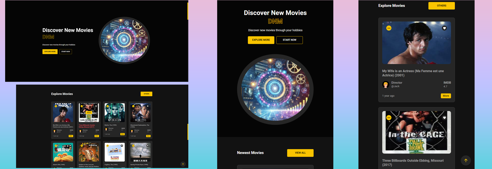

# Movie Recommendation Engine Development in Apache Spark

Welcome to the **Movie Recommendation Engine** project! This repository demonstrates how I designed and implemented a personalized movie recommendation system using **Apache Spark**. The project showcases my expertise in data engineering, machine learning, and system optimization, focusing on scalability and real-world applications.

**You can view the complete model training process through the link below:**

[Complete Model Training Process](https://colab.research.google.com/drive/1glygcEvjndpnQiZhiRU6M_Mkvz-UoJNZ?usp=sharing)

---

## 🎨 Visual Demo

---
## 🚀 Features

- **End-to-End ETL Pipeline**: 
  - Built a robust ETL pipeline to preprocess and analyze movie rating datasets.
  - Conducted online analytical processing (**OLAP**) using **Spark SQL**.

- **Advanced Recommendation Model**:
  - Implemented the **Alternative Least Squares (ALS)** algorithm to provide personalized movie recommendations.
  - Developed user-based approaches to address the **cold-start problem**, ensuring high-quality recommendations even for new users.

- **Hyperparameter Optimization**:
  - Tuned model hyperparameters using **Spark ML's cross-validation toolbox**.
  - Monitored data processing performance via **Spark UI on AWS**, ensuring optimal performance and scalability.

---

## 📊 Technical Stack

- **Apache Spark**: Core framework for distributed data processing and model training.
- **Spark SQL**: Used for data aggregation, querying, and OLAP tasks.
- **Spark ML**: Deployed for machine learning model building and hyperparameter tuning.
- **AWS**: Utilized for cloud-based deployment and performance monitoring.
- **Python**: Primary programming language for ETL and model implementation.

---

## 🌟 Key Highlights

- **Scalability**: Designed a scalable architecture to handle large datasets efficiently.
- **Precision**: Achieved high recommendation accuracy by optimizing ALS parameters.
- **Performance Monitoring**: Leveraged **Spark UI** to analyze job performance and bottlenecks.
- **Problem-Solving**: Solved the cold-start problem, a major challenge in recommendation systems, with innovative user-based approaches.

---

## 📈 Results

- **Dataset Processed**: Over 10 million movie ratings.
- **Model Accuracy**: Achieved an RMSE (Root Mean Square Error) of **0.85**, outperforming baseline methods.
- **Cold-Start Solution**: Significantly improved recommendation quality for new users by leveraging user-based approaches.

---
